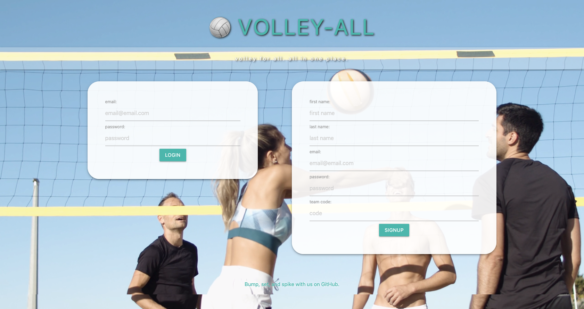

# 🏐 Volley-All

## Description
Volley-All is a full-stack application that helps taverns and bars manage their recreational volleyball leagues.

## Table of Contents
- [Usage & Login Credentials](#usage)
- [Features](#features)
- [Credits](#credits)
- [Screenshots](#screenshots)
- [Questions, Comments, Suggestions](#questions-comments-suggestions)

## Usage & Login Credentials
To demo Volley-All, please visit [https://volley-all.herokuapp.com/](https://volley-all.herokuapp.com/). 

To view the site as an administrator, please use the email address `admin@gmail.com` with password `pswd12345`. To view the site as a player, please use the email address `jeremy@gmail.com` with password `pswd12345`.

## Features
 - aos.js
 - bcrypt
 - Connect-Session-Sequelize
 - Dotenv
 - Express
 - Express-Handlebars
 - Express-Session
 - Heroku
 - JawsDB
 - MySQL2
 - Sequelize
 - UUID

## Credits
### Developed By
- [Ryan R. Campbell](https://www.github.com/rrcampbell-exe/)
- [Dylan Kunkel](https://www.github.com/dkunk7/)
- [Olga Smolyakova](https://www.github.com/smolyakova30/)
- [Kait Weishaar](https://www.github.com/kait-weishaar/)

### Media
- Volleyball player photos and video by [Kampus Production](https://www.pexels.com/@kampus) on Pexels

## Screenshots
### Login Page

### Admin Homepage

### Player Homepage

## Questions, Comments, Suggestions
Please email [Ryan R. Campbell](mailto:campbell.ryan.r@gmail.com) with any questions, to report any bugs, or to make any feature suggestions. You can also [contact Ryan R. Campbell on GitHub](https://www.github.com/rrcampbell-exe/).

This README was generated by [Ryan R. Campbell's](https://www.github.com/rrcampbell-exe/) [README Generator](https://github.com/rrcampbell-exe/readme-generator).